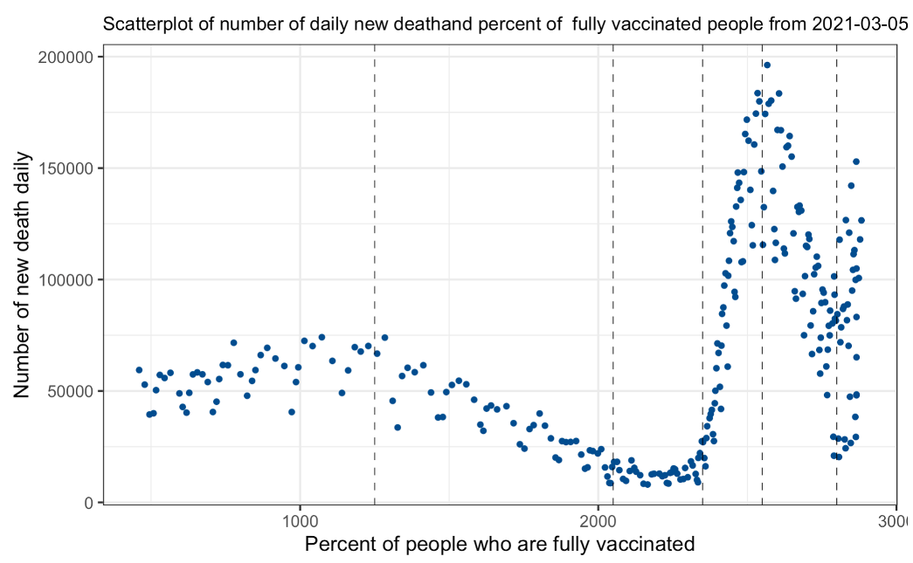

  
## Introduction  
  
As of Dec. 8, 2021, the number of total COVID-19 cases hit 49,322,567 with 119,895 new cases (822,416 cases in the last 7 days), and the number of total COVID-19 deaths hit 788,903 with 1,780 new deaths$^{[1]}$. Since covid-19 virus continues spreading in the United States, many scientists state that the virus will likely be with us for a long time. Therefore, vaccines are playing a very important role in keeping people away from the virus.  
  
In this project, we focus on the relationship between complete vaccination rate and the number of new daily cases by using spline regression model. Also, we compare the number of fully vaccinated people receiving different brands of the vaccine in each state with the number of new daily cases and deaths in order to analyze the vaccine effectiveness of different companies. We use linear regression model to decide the most effective vaccine brand by looking at the coefficients. Finally, we implement a SEIR model to monitor the spread of covid-19 virus and compare it to the actual data using example of Illinois in order to determine the reason affecting the trend of the epidemic.  
  
We collect the data from the CDC official website. There are two datasets we used, one is the “COVID-19 Vaccinations in the United States$^{[2]}$” which has more than 23 thousand rows and 80 columns with variables including date, location, number of fully vaccinated people, and so on. The other is “United States COVID-19 Cases and Deaths$^{[3]}$” which has more than 41 thousand rows and 15 columns with variables including state, number of daily new cases, number of new deaths, and so on.  
  
## Data Analysis  
### Relationship between vaccine rate and COVID-19 death  

##### **Linear regression and model selection**    

In order to study how effective the COVID-19 vaccine saves the majority from severe illness or even death, we analyzed the relationship between the percent of people who are fully vaccinated and the number of daily new death.

Linear regression was used to study the relationship between daily COVID-19 new death and other potential factors including case and vaccine information during the first 3 months from 2021-03-05 (when the first fully vaccinated individual appeared) to 2021-07-05. In addition, stepwise model selection was used to identify the most significant factors contributing to the drop or raise of daily new death. The final model after the stepwise model selection has a multiple R-squared 0.8434, meaning around 85% of the variance of the daily new deaths could be interpreted by the selected factors. 

{width=50%}

$$d = -1.967 t + 3.67 v_1  + -2.693 v_2  + 1.729 c + 368700$$
where $d$ is daily new deaths, 
$t$ is date,
$v1$ is Series_Complete_Pop_Pct: Percent of people who are fully vaccinated (have second dose of a two-dose vaccine or one dose of a single-dose vaccine) based on the jurisdiction where recipient lives,
$v_2$ is Administered_Dose1_Pop_Pct: Percent of population with at lease one dose based on the jurisdiction where recipient lives
$c$ is new_case: daily new COVID-19 cases. 

As the time went by, percent of people who are fully vaccinated were increased, thus contributing to the drop of daily new COVID-19 deaths. The coefficient of daily new COVID-19 cases being positive indicated that the more the cases, the more likely would contributed to the number of deaths. Moreover, percent of population with at lease one dose increased 1, the number of new daily death drops 2.693 while Percent of people who are fully vaccinated increased 1, the number of new daily death raises 3.67.  

##### **improvements to the linear regression: Spline regression** 

Regression splines was used to study the relationship between COVID-19 daily new death and percent of fully vaccinated people from 2021-03-05. Regression splines is one of the most important nonlinear regression techniques. Instead of building one model for the entire date range or percent of fully vaccinated people, we can divide the dataset into separate bins or intervals by setting breakpoints (knots) and fit a separate model on each of these bins, either linear or low degree polynomial functions.

The choice of knots (number and position), the number of degrees of functions in each region would affect the performance of the model, while in particular, the choice of knots can be crucial. We tried 6 different settings of spline, including linear spline, quadratic spline, and cubic spline with 5 customized knots and spline with 5, 7, 10 degrees of parameters. The goodness of fit could be generally accessed from the plots below. 

The daily new death has steadily declined since January 2021. However, there was a rapid and alarming rise in the COVID-19 death around the country at the 2350 percent of fully vaccinated people. Going back to the dataset, we found that the date is around early July. This was when Delta$^{[4]}$ start to be the predominant variant of the virus in the United States. According to CDC, the Delta variant of COVID-19 was more infectious even in vaccinated individuals compared with other variants. 
  
### Effectiveness of three major vaccine companies 

In this part, we want to compare the performance of vaccines from three major companies: Pfizer, Moderna, and Janssen by looking at their abilities of reducing the number of daily new cases and daily new death. We first combine the data of all 50 states from March 2021 to November 2021, and use a line chart to see their trend.  
  
{width=50%} 
  
The plot shows the change of everyday new fully vaccinated people with three major vaccine companies as well as the change of daily new cases and death. We notice that Pfizer vaccine dominates the number of vaccination for most of the time. The number of people receiving janssen vaccine is the least. The trend of new cases reflects that the vaccines are useful in preventing the virus where the larger number of fully vaccinated people the lower number of new cases.  
  
Furthermore, we would like to discover the difference of the three major vaccines on controlling new cases and new death. We then group the data by each of the 50 states in US and perform a linear regression on both "new_case" and "new_death". We record the brand of vaccine which takes larger effect on reducing the number of new cases and new death comparing to the other (which is the largest negative value in the coefficients of regression model). We plot the results in pie charts below.  
  
{width=45%}
{width=45%}  
  
As we can see, Moderna vaccine outperforms the other two on both decreasing the number of new cases and new death in more than half of the states. The second is Pfizer vaccine which wins in about one third of the states. This result also matches the report of comparing the effectiveness of three vaccines in preventing COVID-19 hospitalizations from CDC, which states Moderna vaccine has the higher vaccine effectiveness against COVID-19 hospitalizations (93%) comparing to Pfizer (88%) and Janssen (71%)$^{[5]}$.
  
### SEIR MODEL
  
##### **Principle introduction**
The article firstly makes one simple assumption. For example: 
In the transmission of an infectious disease, the number of patients at time t is x(t), which is a continuous and differentiable function. During the transmission process, the effective number of contacts per patient per day is a fixed value &lambda; (effective contact is enough to make contact human disease exposure). When &Delta;t is sufficiently small, the increase in the number of patients within the target time period [t, t+&Delta;t]can be approximately expressed as

$$x(t+\Delta t)-x(t)=\lambda x(t)\Delta t$$

##### **Classic SEIR Model**

The classic SEIR model takes into account the incubation period of the virus and the healthy people (R) who are immune after recovery.$^{[6]}$The assumptions of the SEIR model are as follows:

* Assuming that the total number of people is constant N, the population is divided into 4 categories: susceptible population (S), latent population (E), infected person (I), and removed population (R).
* Assuming that the number of infections of the infected person is r, the infection rate of the susceptible population is &beta;, the incidence probability of the latent population (that is, the probability of becoming an infected person) is &alpha;, and the recovery coefficient of the infected person (that is, the probability of an infected person recovering) is &gamma;.

Based on the above assumptions, the following differential equations are obtained:

$$\frac{\partial S}{\partial t}=-r\beta I\frac{S}{N}$$
$$\frac{\partial E}{\partial t} = r\beta I\frac{S}{N}-\alpha E$$ 
$$\frac{\partial I}{\partial t} = \alpha E-\gamma I$$
$$\frac{\partial R}{\partial t} = \gamma I$$

From the principle of the CLASSIC SEIR Model, since the probability of a latent person being transformed into an infected person and the probability of an infected person being cured are fixed, the SEIR model cannot simulate mutations in the development of an epidemic.

##### **Improved SEIR model**

Compared with the previous model, the improved SEIR model is the model used in this project. It considers the isolation measures to prevent infectious diseases and the isolation and treatment of designated hospitals on the basis of CLASSIC SEIR MODEL. Assumptions are made about the model: 

* On the basis of the classic SEIR model, new groups are added: isolated susceptible people (Sq), isolated latent people (Eq), isolated infected people (Iq), hospitalized patients (H). Those who are isolated and infected will be sent directly to the local designated hospital for isolation and treatment, so all these people will eventually be converted into hospitalized patients.

* Taking into account the existence of death cases, the daily increase in the number of deaths is newly added. In the latter stage of the model, considering the development of vaccines and virus mutations, immune parameters and re-infection virus parameters are added.

In terms of parameters, suppose the proportion of isolation is q; the probability of infection is &beta;; the number of contacts is r; the ratio of the transmission capacity of latent patients to infected persons is &theta;; the incidence probability of latent populations (that is, the probability of becoming infected) is &alpha;; The recovery coefficient of the infected person (that is, the probability of the infected person recovering) is &gamma;I; the recovery coefficient of isolating the infected person is &gamma;H; the probability of isolating the latent person to isolating the infected person is &tau;q; the isolation probability of the infected person is &tau;i; The rate of release of isolation is &lambda; the probability of re-infection with the virus per person who is cured is j; the vaccine parameter is jv;the virus mutation parameter is jm.

Based on the above assumptions, we establish a system of differential equations:
  
  
$$\frac{\partial S}{\partial t} = -(r\beta-rq(1-\beta))(I+\theta E)\frac{S}{N}+\lambda S+(j-j_v+j_m)R_q$$
$$\frac{\partial E}{\partial t} = r\beta(1-q)(I+\theta E)\frac{S}{N}-\alpha E_q$$
$$\frac{\partial I}{\partial t} = \alpha E-(\tau_I+\gamma_I)I$$
$$\frac{\partial S_q}{\partial t} = rq(1-\beta)(I+\theta E)\frac{S}{N}-\lambda S_q$$
$$\frac{\partial E_q}{\partial t} = r\beta q(I+\theta E)\frac{S}{N}-\tau_q E_q$$
$$\frac{\partial H}{\partial t} = \tau_q E_q+\tau_I I-\gamma_H H$$
$$\frac{\partial R}{\partial t} = \gamma_H H+\gamma_I I-(j-j_v+j_m)R$$
  
##### **Empirical analysis**

The research object of this project is the Covid-19 epidemic data in Illinois from 2020-03-12 to 2021-12-01. The target fitting object is the number of Active cases(Patients who are currently infectious and have already developed the disease). 

  
  
First of all, it is not difficult to see that Illinois will usher in a major outbreak from 2020-03. It can be seen from the figure that the actual data from 2020-03 to 2020-09 is far from the model. The data during this period is difficult to fit the model because there are many exposed patients in the early stage of the epidemic so the number of these patients cannot be estimated. In addition, many infected patients are still unaware that they are infected with Covid-19 and think they are just a cold, which gives the reason why the number of infections exploded in the early stage of the epidemic. The parameter setting in the early stage of the model:
Because people lacked knowledge of the virus and lacked self-prevention measures (such as masks), the isolation coefficient was set to 0. According to the reference data, the average number of contacts is between 3-4 and the model with r = 3.34 has the best effect.

Secondly, the middle part of the model (2020-09 to 2021-03) is a typical SEIR model. It is not difficult to see through the result graph that the model fits the development trend of the epidemic well. During this period, the epidemic began to spread on a large scale, but correspondingly, the government began to take some anti-epidemic measures. For example, began to use the medical system to isolate and treat some patients; encourage people to take self-prevention measures. The reflection in the model is: the isolation coefficient is about 1*e-6 (data comes from the Internet), and the number of contacts per capita has dropped to 3.27. In this case, the epidemic is well controlled.

Thirdly, the epidemic rebounded from 2021-03 to 2021-05 but was under control thereafter. After checking the news, the weather warmed up during this period, the infectivity of the virus has been enhanced, and people who have partially recovered may be infected with the virus again. Therefore, during this period, the addition of the re-infection coefficient j provides a good interpretation of the data changes during this period. The reason why the 2020-06 epidemic is under control is the widespread availability of vaccines (derived from the data set clean_vac_state). Adding the vaccine coefficient jv during this period can also explain the graph change well.

In the last part, the epidemic spread again from 2021-07. After reading the news, I found that the reason for this situation was that the virus had mutated, causing some of the people who had recovered to become susceptible. In the model setting, I added the coefficient of variation, which is the probability of changing from a cured population to susceptible. It is not difficult to see from the figure that the degree of model fit at this stage is not high. The reason may be that the model has become saturated at this stage. Forcibly adding a variable parameter will reduce the degree of influence on the model itself$^{[7]}$.

### Conclusion  

In general, we discovered that the daily new death has steadily declined since January 2021. However, there was a rapid and alarming rise in deaths in early July. The results of linear regression and stepwise model selection showed that date, percent of fully vaccinated people, and daily new COVID-19 cases were the most significant factors contributing to the drop of daily new death the first three months after 2021 March. Then, spline regression was also used to improve the results of linear regression to enable us to study the relationship between daily new deaths and the percent of fully vaccinated people during different time periods. Furthermore, by comparing the daily statistics of fully vaccinated people with three major vaccine companies to the number of daily new cases and new death, we concluded that the vaccines are effective in controlling the spread of the COVID-19 virus. Within the 50 states of the US, the Moderna vaccine seems to perform better in both reducing new cases and new death competing with Pfizer and Janssen. However, our regression model doesn't take all factors into consideration, such as the population in each state, the effect in different age groups, the period of protection, and so on, which need to be further discussed. Moreover, we implemented a SEIR model which is a dynamic model used to monitor the spread of the virus to stimulate the activities of the COVID-19 virus in Illinois. In our model, we summarized the main reason affecting the trend of the epidemic in Illinois is government epidemic prevention measures, medical treatment, the death of patients, virus mutation, and cause re-infection. The model is not considered perfect due to probable population shift, medical environment difference between areas, and so on, which is interesting to research more. 

## Reference  

[1] Centers for Disease Control and Prevention. (n.d.). CDC Covid Data tracker. Retrieved December 8, 2021, from https://covid.cdc.gov/covid-data-tracker/#vaccinations_vacc-total-admin-rate-total.  

[2] "United States COVID-19 Cases and Deaths by State over Time," https://data.cdc.gov/Case-Surveillance/United-States-COVID-19-Cases-and-Deaths-by-State-o/9mfq-cb36.  
  
[3] "COVID-19 Vaccinations in the United States,Jurisdiction," https://data.cdc.gov/Vaccinations/COVID-19-Vaccinations-in-the-United-States-Jurisdi/unsk-b7fc.  

[4] Bernal JL, Andrews N, Gower C, et al. Effectiveness of Covid-19 Vaccines against the B.1.617.2 (Delta) Variant. N Engl J Med. 2021 Jul 21;doi:10.1056/NEJMoa2108891external icon.  

[5] “Comparative Effectiveness of Moderna, Pfizer-Biontech, and Janssen (Johnson &amp; Johnson) Vaccines in Preventing COVID-19 Hospitalizations among Adults without Immunocompromising Conditions - United States, March–August 2021.” Centers for Disease Control and Prevention, Centers for Disease Control and Prevention, 23 Sept. 2021, https://www.cdc.gov/mmwr/volumes/70/wr/mm7038e1.htm.  
  
[6] TANG B, WANG X, LI Q，et al. Estimation of the transmission risk of 2019-nCov and its implication for public health interventions[J]. J Clin Med, 2020, 9(2):462. DOI: 10.3390/jcm9020462.  

[7] Yang Yu,Xu Liguang. Stability of a fractional order SEIR model with general incidence[J]. ApplEId Mathematics Letters,2020(prepublish).

